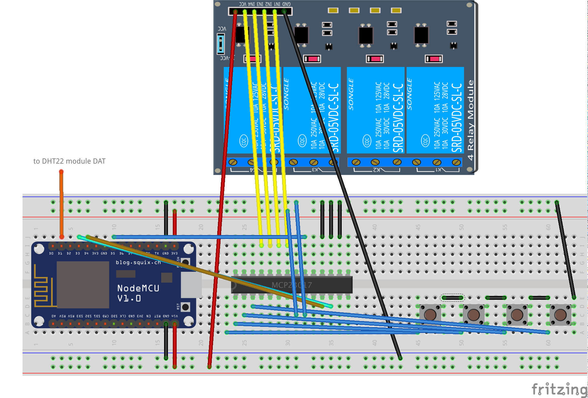
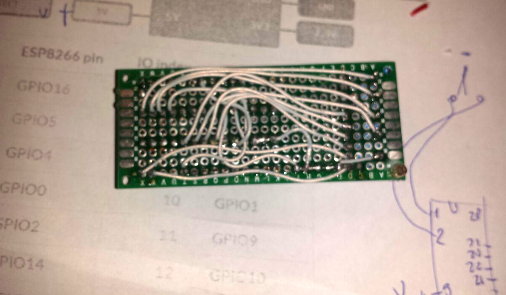
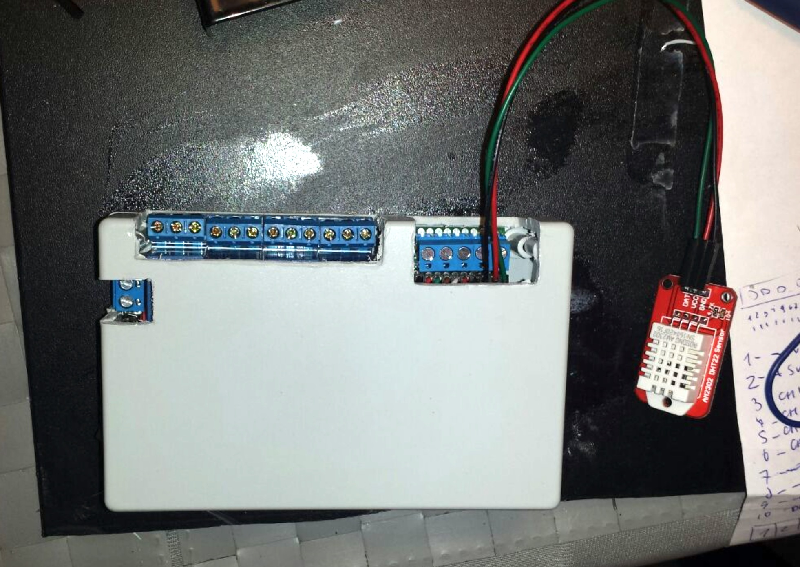
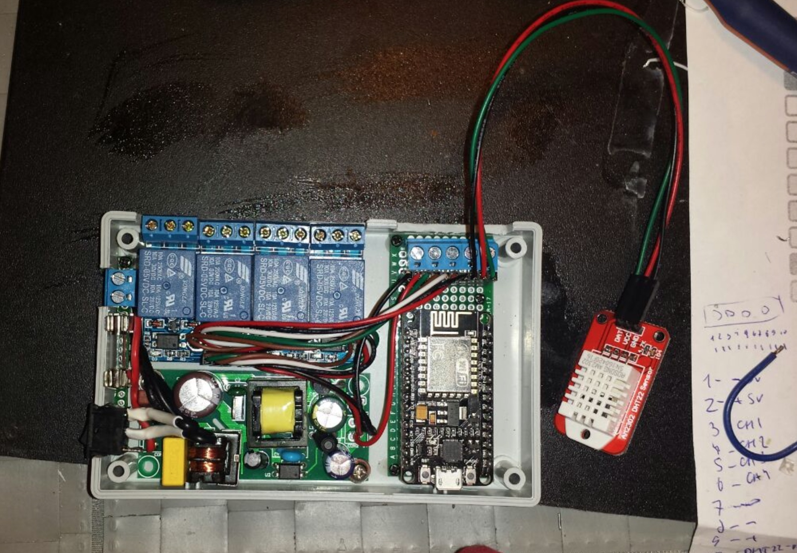

# Home IoT light switch on NodeMCU (ESP8266)
Устройство предназначено для управления освещением либо вентиляцией в квартире.
Каждое устройство размещается в распределительной коробке комнаты, куда приходит питание, провода от ламп либо вентиляторов и от кнопок.
Предполагается, что реле можно управлять как удаленно, так и при клике на обычный выключатель.
Выключатель должен быть не перекидной, а в виде кнопки.

Управлять можно например через Openhab:
https://github.com/ssk181/home-switch-openhab

## Hardware
- NodeMCU
- MCP23017
- Relay's (1 - 8)
- Buttons (1 - 8)
- DHT11 or DHT22

## MQTT-сообщения
Устройство шлет сообщения о каждом действии в MQTT очередь:

- /home/iot/{Device-IP}/out/online               *- ON - соединился с очередью MQTT, OFF - разъединился (LWT)*
- /home/iot/{Device-IP}/out/button/{ButtonIndex} *- 1 - короткое нажатие, 2 - длинное*
- /home/iot/{Device-IP}/out/relay/{RelayIndex}   *- ON или OFF*
- /home/iot/{Device-IP}/out/climate/temp         *- Температура в градусах*
- /home/iot/{Device-IP}/out/climate/humidity     *- Влажность в процентах*
- /home/iot/{Device-IP}/out/state/uptime         *- Время работы устройства с момента последней загрузки в секундах*
- /home/iot/{Device-IP}/out/state/memory         *- Свободная память в байтах*
- /home/iot/{Device-IP}/out/state/relay/{RelayIndex} *- Статус реле ON или OFF*

И принимает сообщения:
- /home/iot/{Device-IP}/in/relay/{ButtonIndex}  *- ON | OFF | INVERT*
- /home/iot/{Device-IP}/in/climate/temp         *Без сообщения*
- /home/iot/{Device-IP}/in/climate/humidity     *Без сообщения*
- /home/iot/{Device-IP}/in/state/uptime         *Без сообщения*
- /home/iot/{Device-IP}/in/state/memory         *Без сообщения*
- /home/iot/{Device-IP}/in/state/relay          *Без сообщения*

## Installation
1. Установить прошивку integer с модулями: *bit, dht, file, gpio, i2c, mqtt, net, node, tmr, uart, wifi* (собрать можно самому либо тут: http://nodemcu-build.com/)
2. Установить на компьютер nodemcu-tool:
   *npm install nodemcu-tool -g*
3. Скриптом *./upload.sh* выгрузить данные скрипты на NodeMCU

